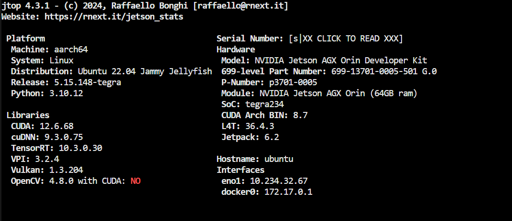

# build in tensorrt10

# finish all things before onnx generated in docker of workstation

# build engine in orin
export PATH=$PATH:/usr/src/tensorrt/bin/
export LD_LIBRARY_PATH=$LD_LIBRARY_PATH:/usr/lib/aarch64-linux-gnu/

# in the folder of /workspace/DL4AGX/AV-Solutions/vad-trt/export_eval 

trtexec --onnx=scratch/vadv1.extract_img_feat/sim_vadv1.extract_img_feat.onnx \
        --staticPlugins=../plugins/build/libplugins.so \
        --profilingVerbosity=detailed --dumpProfile \
        --separateProfileRun --useSpinWait --useManagedMemory \
        --fp16 \
        --saveEngine=scratch/vadv1.extract_img_feat/vadv1.extract_img_feat.fp16.engine

trtexec --onnx=scratch/vadv1_prev.pts_bbox_head.forward/sim_vadv1_prev.pts_bbox_head.forward.onnx \
        --staticPlugins=../plugins/build/libplugins.so \
        --profilingVerbosity=detailed --dumpProfile \
        --separateProfileRun --useSpinWait --useManagedMemory \
        --saveEngine=scratch/vadv1_prev.pts_bbox_head.forward.engine

